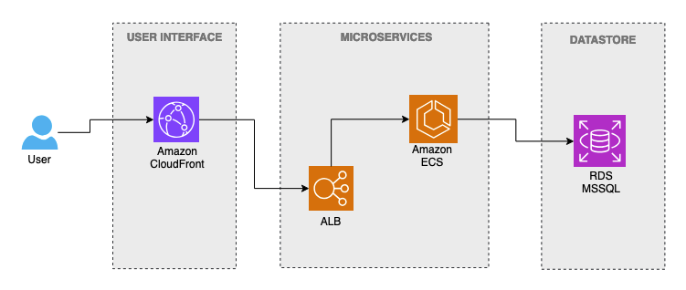

# Simple Sales API (.NET)
This is a simple sales API service that allows you to post sales, retrieve sales, fetch sales by transaction ID, and generate daily sales reports.

High level architecture diagram - Simple Sales API Services

## Developer Guide :blue_book:

**To run this application, following environment variables are required.**
export ASPNETCORE_ENVIRONMENT=Development
export DB_CONNECTION_STRING="Server=dbserver;Database=devops_challenge;User Id=sa;Password=test1234Fm@;"

To build & run commands,

docker-compose build
docker-compose up

Swagger url (local): http://localhost:5000/swagger/index.html

